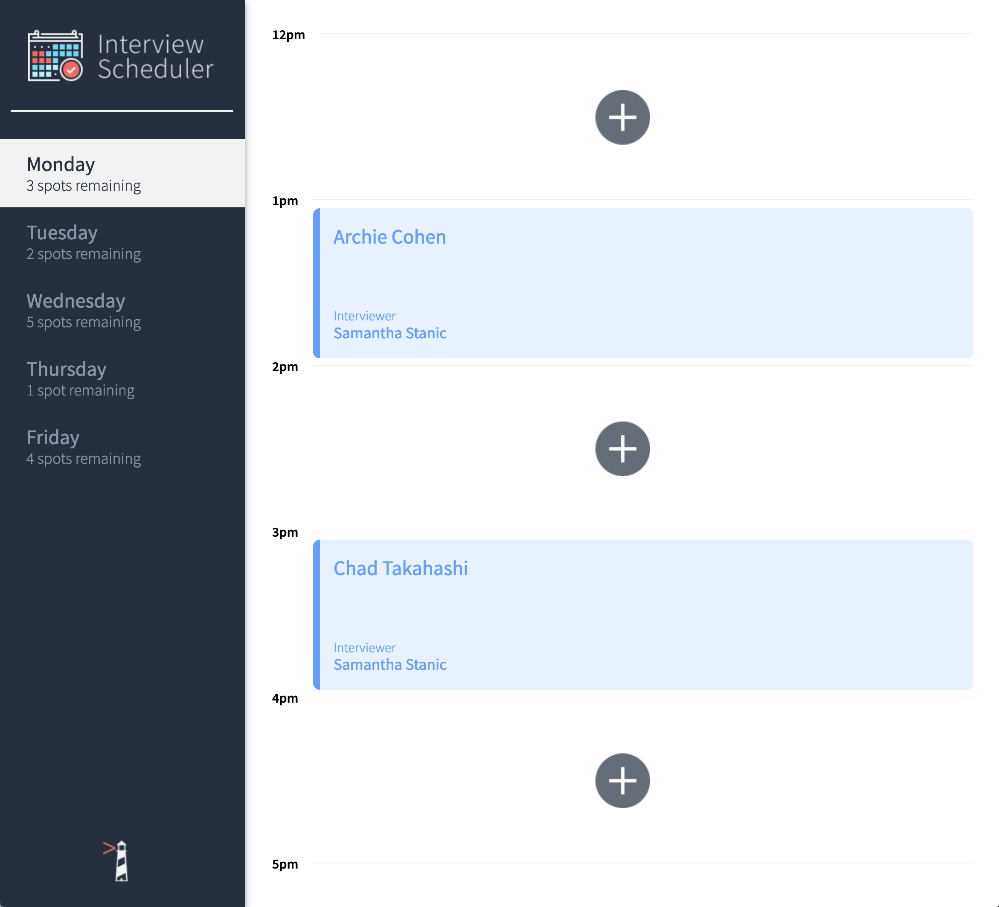
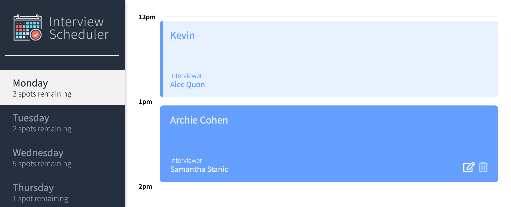
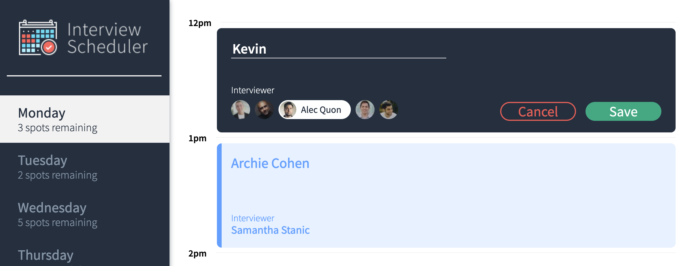
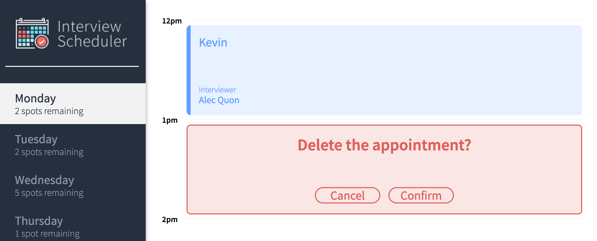

# Interview Scheduler
## Description

Interview Scheduler is a react app developed for students to book interview with mentors.

The app displays a left side panel allow users to select the available day to book interview. The spots remaining is an indicator of avaiable spot to book. If the day is full 5/5 interviews, the day item will be greyed out.

On the main panel, there is a range time between 12pm to 5pm, however, no interview can be booked after 5pm.

The user can create, edit and delete interview. They can edit their name and change interviewer before saving it.

This app has gone throught Unit Testing, Integration and End to End testing from Storybook to Cypress.

## App
Go to [localhost:8000](http://localhost:8000/) after starting the `npm start`.

## Screenshot
#### Landing Page


#### Available Options for Edit and Delete


#### Appointment Creation or Edit


#### Appointment Delete


## dependencies

- axios: ^0.20.0
- classnames: ^2.2.6
- normalize.css: ^8.0.1
- react: ^16.9.0
- react-dom: ^16.9.0
- react-scripts: 3.4.4

## devDependencies

- storybook: ^5.0.10
- testing-library: ^8.0.7
- prop-types: ^15.8.1
- react-test-renderer: ^16.9.0
- sass: ^1.53.0
- eslint: ^6.8.0
- eslint-plugin-react: ^7.33.1
- eslint-plugin-react-hooks: ^1.7.0
- cypress: ^9.7.0

## Setup & API Server

1. Clone this `scheduler`.
2. Install dependencies with `npm install`.

3. Fork and clone the [scheduler-api](https://github.com/lighthouse-labs/scheduler-api) into a new directory (NOT within our current scheduler directory) on your host machine (not in our Vagrant machine).

4. Follow the `README.md` in `scheduler-api`'s instructions. This will involve a few steps, including:

- installing dependencies
- creating the database
- creating a `.env.development` file in the root directory
- seeding the database
- running the server

5. The `.env.development` should contain the following:

```js
PGHOST=localhost
PGUSER=development
PGDATABASE=scheduler_development
PGPASSWORD=development
PGPORT=5432
```

## Running Webpack Development Server

```sh
npm start
```

## Running Jest Test Framework

```sh
npm test
```

## Running Storybook Visual Testbed

```sh
npm run storybook
```

## Notes
This app is create for Lighthouse Labs project.